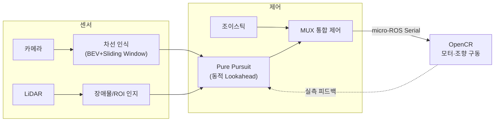
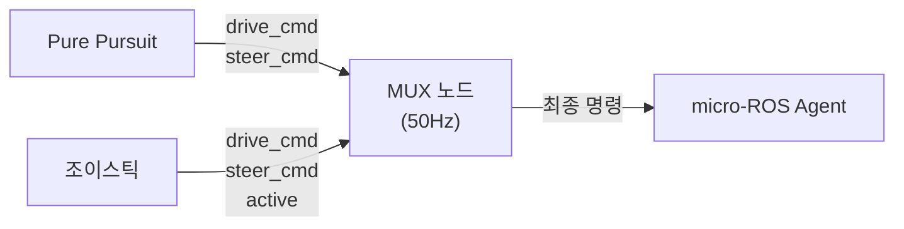
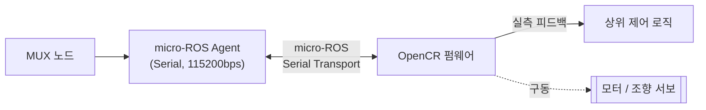
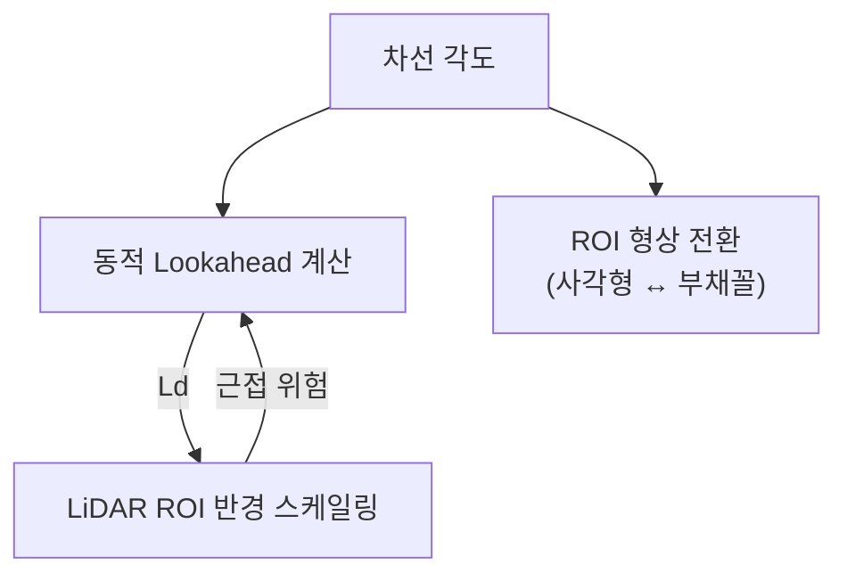

# 🏎️ URRC 1/10 자율주행 레이스카

**ROS 2 기반 차선 인식 · LiDAR 인지 · Pure Pursuit 제어 통합 자율주행 스택**

> 🔒 이 저장소는 **프로젝트 소개용**입니다. 전체 소스코드는 Private 저장소에 있으며, 열람은 별도 문의해 주세요.

---

카메라 기반 차선 인식과 LiDAR 기반 장애물/ROI 인지를 결합해 Pure Pursuit 제어기로 실차를 구동하는 ROS 2 자율주행 스택입니다. 섀시 설계부터 MUX 제어, micro-ROS 기반 모터 구동, LiDAR 연동 동적 제어 로직까지 하드웨어–소프트웨어 전 구간을 담당했습니다.

| 담당 | 역할 |
|---|---|
| 김건홍 ([@GeonHoong](https://github.com/GeonHoong)) | 하드웨어(섀시) 설계 총괄, MUX 통합 제어, micro-ROS 모터 제어 아키텍처, LiDAR Lookahead/ROI 가변 제어 |
| 공동 개발자 | ROS 2 자율주행 노드, BEV 변환, Pure Pursuit 제어, RPLIDAR 연동 |

## 🗺 전체 아키텍처

---

## 🎯 핵심 기여 (직접 설계·구현)

<b>1. MUX 통합 제어 노드</b>

자율주행(Pure Pursuit)과 수동 조이스틱 명령을 하나의 최종 제어 명령으로 안전하게 중재하는 노드입니다.

- **중재 로직**: 조이스틱 활성 신호가 최근 0.6초 이내면 조이스틱 우선, 아니면 자율주행 명령 사용
- **주기 제어**: 50Hz(20ms) 타이머로 최종 명령을 일관되게 발행해 두 입력 전환 시 끊김 방지
- **충돌 방지**: 두 입력 소스가 서로 반대 모드일 때 자기 값을 갱신하지 않도록 설계해 명령 혼입 차단

<b>2. micro-ROS(OpenCR) 실시간 모터 제어 아키텍처</b>

상위 PC의 ROS 2(DDS) 네트워크와 임베디드 보드(OpenCR)를 micro-ROS로 연결해, 제어 계층과 액추에이터 구동 계층을 분리한 실시간 제어 아키텍처입니다.

- **PC ↔ 보드 브리지**: 시리얼 transport 기반 DDS–micro-ROS 브리지 구성
- **폐루프 제어**: 보드가 반환하는 실측 피드백을 상위 제어 로직(Lookahead 상한 계산 등)에 재사용
- **계층 분리 설계**: 제어 알고리즘과 하드웨어 구동 로직을 토픽 레벨에서 분리해 독립적으로 개발·디버깅 가능
- **기동 순서 관리**: 제어 노드 → micro-ROS 브리지 → MUX 순으로 이벤트 체이닝해 초기 명령 유실 방지

<b>3. LiDAR 기반 Lookahead 동적 조정 & ROI 가변 제어</b>

차선 곡률·조향각·주행 속도에 따라 Pure Pursuit의 Lookahead 거리(Ld)와 LiDAR 인식 ROI를 실시간으로 함께 가변시켜, 고속 직선 구간의 안정성과 저속 코너 구간의 추종 성능을 동시에 확보하는 로직입니다.

- **동적 Ld 계산**: 차선 각도가 임계값을 넘으면 최대 각도 구간까지 선형으로 Ld를 최소값까지 축소, 속도 피드백으로 Ld 상한도 별도 캡핑
- **ROI 형상 전환**: 직선 구간은 사각형, 곡선 구간은 부채꼴(Fan) ROI로 전환하며 히스테리시스로 경계 진동 방지
- **ROI 반경 스케일링**: Lookahead 거리에 비례해 LiDAR 안전 ROI 반경을 실시간 조정
- **안전 게이팅**: ROI 내 최소 거리가 임계값 이하로 들어오면 비상정지 시퀀스를 상위 제어 노드에 트리거

---

## 🔧 하드웨어 (Hardware)

Autodesk Inventor로 1/10 스케일 섀시를 직접 설계하고, 실제 부품으로 조립·구동까지 진행했습니다.

### 설계 (CAD)
<!-- TODO: Inventor 설계 이미지로 교체. 예) assets/hardware/design.png -->

### 실제 제작
<!-- TODO: 실제 조립된 RC카 사진으로 교체. 여러 장이면 행을 추가 -->

### 🎥 작동 영상
<!-- TODO: 유튜브 등에 업로드 후 아래 링크와 썸네일 이미지 경로를 교체
      -->
> 작동 영상 추가 예정

---

## 📎 그 외 구현 요소 (간략)

| 구성 요소 | 내용 |
|---|---|
| 차선 인식 | BEV 변환 + HSV 세그멘테이션 + Sliding Window 기반 실시간 차선 검출 (OpenCV, C++) |
| Pure Pursuit 제어 | 차선 모델 기반 조향 계산, 차선 변경 FSM, TTC 기반 속도 제어 |
| LiDAR-카메라 퓨전 | 캘리브레이션 도구 및 좌표계 정합, 장애물 클러스터링/추적 |
| 시스템 구성 | ROS 2 다중 노드 launch 체이닝, 실시간 파라미터 튜닝 인터페이스 |

## 현재 시스템 한계
- 3km/h 이상 주행 시 불안정 (LiDAR 스캔 주기상 한계)
