

    

# 🏎️ 1/10 자율주행 레이스카

**Raspberry Pi 5 · ROS 2 기반 차선 인식 · LiDAR 인지 · Pure Pursuit 제어 통합 자율주행**

> 🔒 이 저장소는 **프로젝트 소개용**입니다. 전체 소스코드는 Private 저장소에 있으며, 열람은 별도 문의해 주세요.

---

카메라 기반 차선 인식과 LiDAR 기반 장애물/ROI 인지를 결합해 Pure Pursuit 제어기로 실차를 구동하는 ROS 2 자율주행 스택입니다. 섀시 설계부터 MUX 제어, micro-ROS 기반 모터 구동, LiDAR 연동 동적 제어 로직까지 하드웨어–소프트웨어 전 구간을 담당했습니다.

## 🎯 프로젝트 목표

**"제5회 국제 대학생 EV 자율주행 경진대회" — 1/10 Autonomous Mobility Racing** 종목 출전을 목표로 개발했습니다. 대회 규정(요약)은 다음과 같습니다.

- **동시 출발 레이스**: 예선(지정 코스 2바퀴 기록)으로 출발 순서를 정한 뒤, 본선에서는 모든 참가 차량이 동시에 출발해 지정된 바퀴 수를 먼저 완주해야 합니다.
- **차선 유지 원칙 + 차선 변경 허용**: 기본적으로 차선을 유지해야 하지만, 주행 효율을 위한 차선 변경은 허용됩니다(단, 변경하려는 차선의 다른 차량 주행을 방해해서는 안 됨).
- **전방 차량 충돌 금지**: 동일 차로에서 전방 차량을 만나면 속도를 맞추거나 **차선을 변경해 안전하게 추월**해야 하며, 충돌 시 후방 차량에 페널티(5초 정지)가 부과됩니다.
- **완주 조건**: 본선 제한 시간(최대 2시간) 내 미완주 시 실격 처리됩니다.

즉, **여러 대의 차량이 동시에 출발해 앞 차량을 안전하게 차선 변경으로 피하며 지정된 바퀴 수를 먼저 완주하는 것**이 이 프로젝트의 목표이며, 위 3대 핵심 기여(MUX 제어, micro-ROS 모터 제어, LiDAR Lookahead/ROI 가변 제어)는 모두 이 목표를 달성하기 위해 설계되었습니다.

  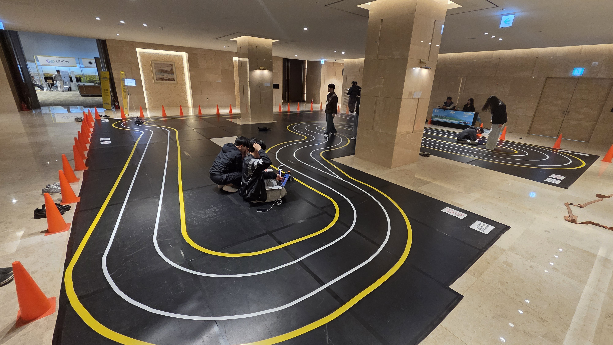 
  대회 트랙 모습 — 흰색/노란색 차선을 기준으로 차선 유지·변경이 이루어지는 실제 주행 코스

| 담당 | 역할 |
|---|---|
| 김건홍 (팀장, [@GeonHoong](https://github.com/GeonHoong)) | 하드웨어 및 소프트웨어 총괄 — 하드웨어(섀시) 설계, MUX 통합 제어, micro-ROS 모터 제어 아키텍처, LiDAR Lookahead/ROI 가변 제어 |
| 공동 개발자 | ROS 2 자율주행 노드, BEV 변환, Pure Pursuit 제어, RPLIDAR 연동 |

## 🗺 전체 아키텍처

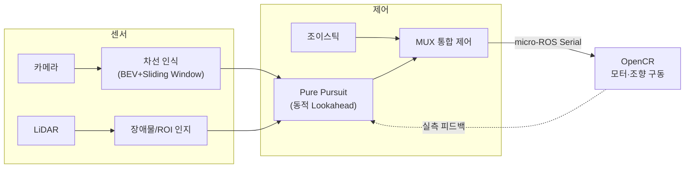

---

## 🎯 핵심 기여 (직접 설계·구현)

<b>1. MUX 통합 제어 노드</b>

자율주행(Pure Pursuit)과 수동 조이스틱 명령을 하나의 최종 제어 명령으로 안전하게 중재하는 노드입니다.

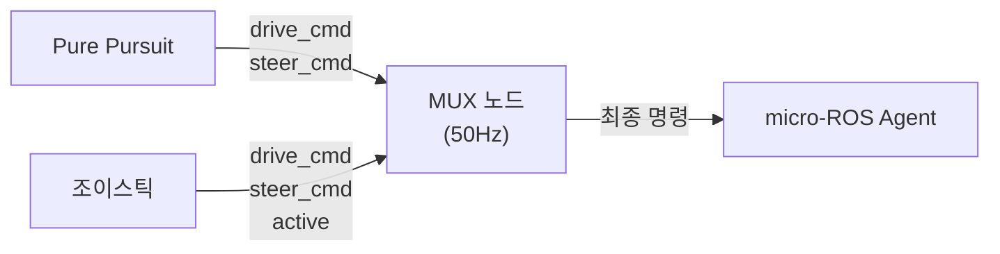

- **중재 로직**: 조이스틱 활성 신호가 최근 0.6초 이내면 조이스틱 우선, 아니면 자율주행 명령 사용
- **주기 제어**: 50Hz(20ms) 타이머로 최종 명령을 일관되게 발행해 두 입력 전환 시 끊김 방지
- **충돌 방지**: 두 입력 소스가 서로 반대 모드일 때 자기 값을 갱신하지 않도록 설계해 명령 혼입 차단

<b>2. micro-ROS(OpenCR) 실시간 모터 제어 아키텍처</b>

상위 PC의 ROS 2(DDS) 네트워크와 임베디드 보드(OpenCR)를 micro-ROS로 연결해, 제어 계층과 액추에이터 구동 계층을 분리한 실시간 제어 아키텍처입니다.

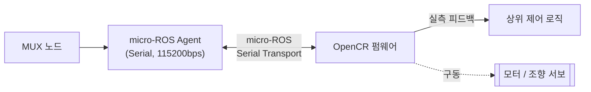

- **컴퓨팅 구조**: 메인 컨트롤러 **Raspberry Pi 5**(인지·판단 — 차선 인식, LiDAR 처리, Pure Pursuit 등 ROS 2 노드 전체 실행) + 서브 컨트롤러 **OpenCR**(모터·서보 실시간 구동 전담)로 역할 분리
- **PC ↔ 보드 브리지**: 시리얼 transport 기반 DDS–micro-ROS 브리지 구성
- **폐루프 제어**: 보드가 반환하는 실측 피드백을 상위 제어 로직(Lookahead 상한 계산 등)에 재사용
- **계층 분리 설계**: 제어 알고리즘과 하드웨어 구동 로직을 토픽 레벨에서 분리해 독립적으로 개발·디버깅 가능
- **기동 순서 관리**: 제어 노드 → micro-ROS 브리지 → MUX 순으로 이벤트 체이닝해 초기 명령 유실 방지

<b>3. LiDAR 기반 Lookahead 동적 조정 & ROI 가변 제어</b>

차선 곡률·조향각·주행 속도에 따라 Pure Pursuit의 Lookahead 거리(Ld)와 LiDAR 인식 ROI를 실시간으로 함께 가변시켜, 고속 직선 구간의 안정성과 저속 코너 구간의 추종 성능을 동시에 확보하는 로직입니다.

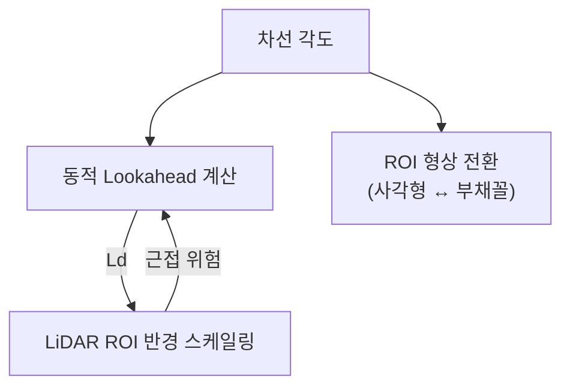

- **동적 Ld 계산**: 차선 각도가 임계값을 넘으면 최대 각도 구간까지 선형으로 Ld를 최소값까지 축소, 속도 피드백으로 Ld 상한도 별도 캡핑
- **ROI 형상 전환**: 직선 구간은 사각형, 곡선 구간은 부채꼴(Fan) ROI로 전환하며 히스테리시스로 경계 진동 방지
- **ROI 반경 스케일링**: Lookahead 거리에 비례해 LiDAR 안전 ROI 반경을 실시간 조정
- **안전 게이팅**: ROI 내 최소 거리가 임계값 이하로 들어오면 비상정지 시퀀스를 상위 제어 노드에 트리거

---

## 🔧 하드웨어 (Hardware)

Autodesk Inventor로 1/10 스케일 섀시를 직접 설계하고, 실제 부품으로 조립·구동까지 진행했습니다. 메인 마이크로컨트롤러는 **Raspberry Pi 5**, 서브 마이크로컨트롤러는 **OpenCR**을 사용했습니다.

### 설계 (CAD)
Autodesk Inventor로 설계한 섀시 모델입니다. LiDAR·카메라 마운트, 전장 배치, 서스펜션 구조를 3D로 먼저 설계한 뒤 제작에 들어갔습니다.

  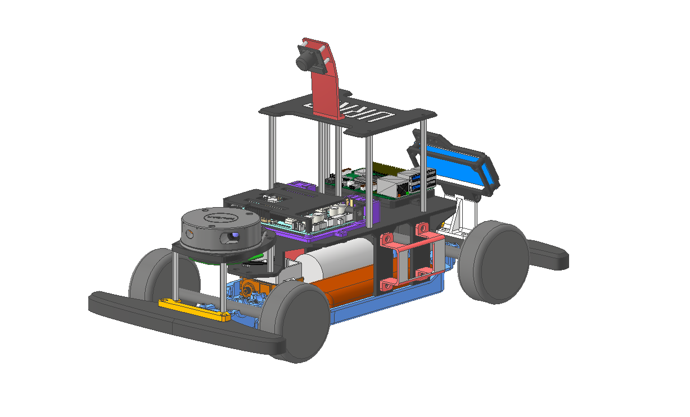
  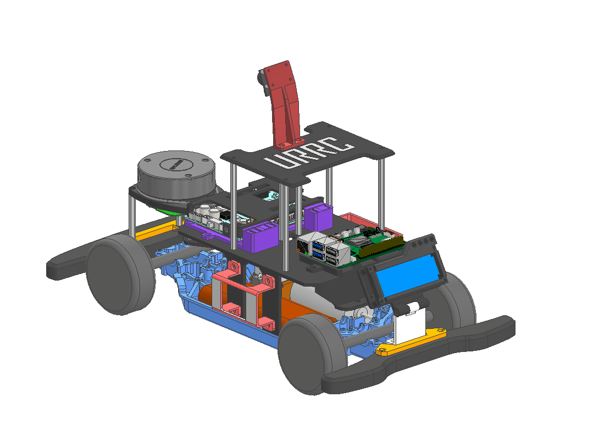
  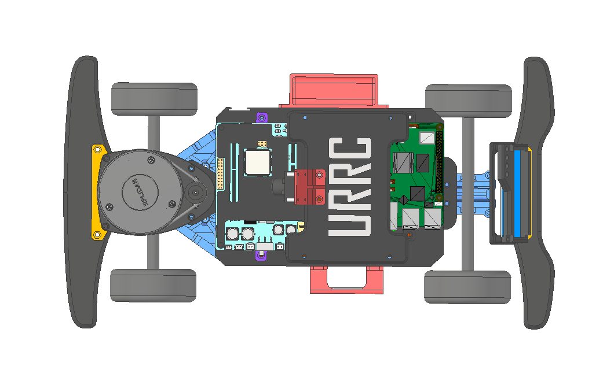

### 제작 과정
OpenCR 모터 드라이버 배선, 카메라 인식 테스트, 전체 시스템 통합 테스트 등 초기 조립·검증 단계입니다.

  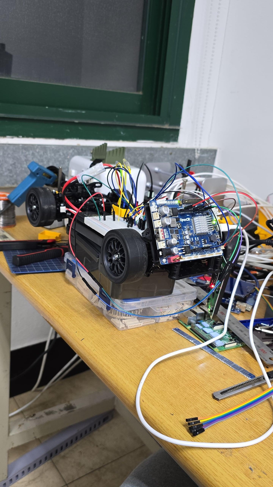
  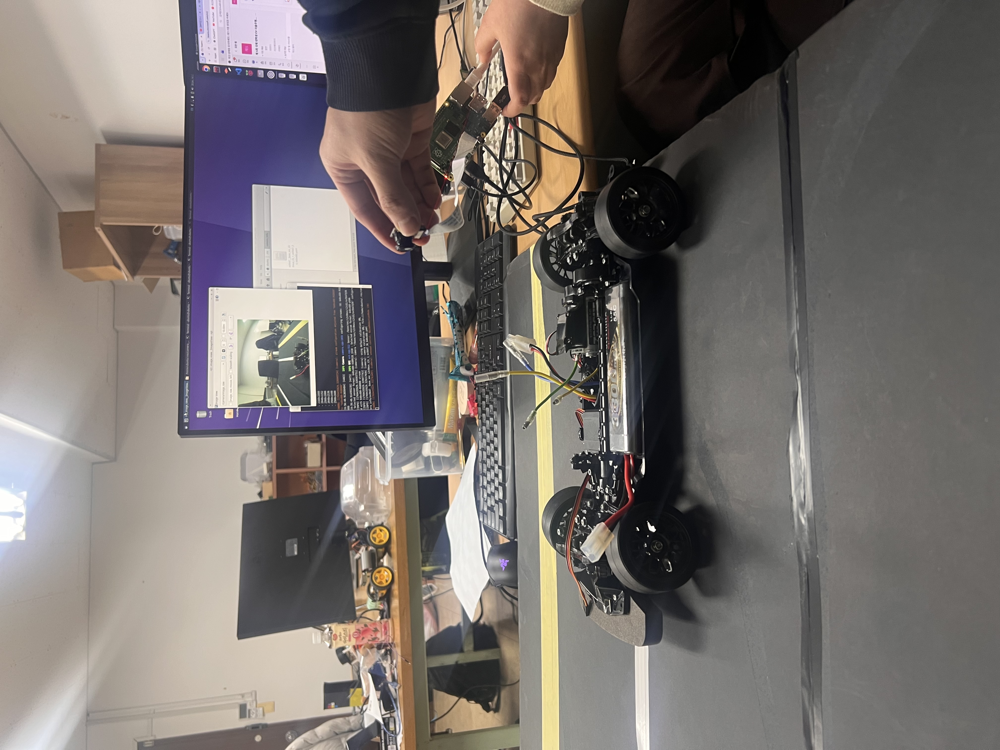
  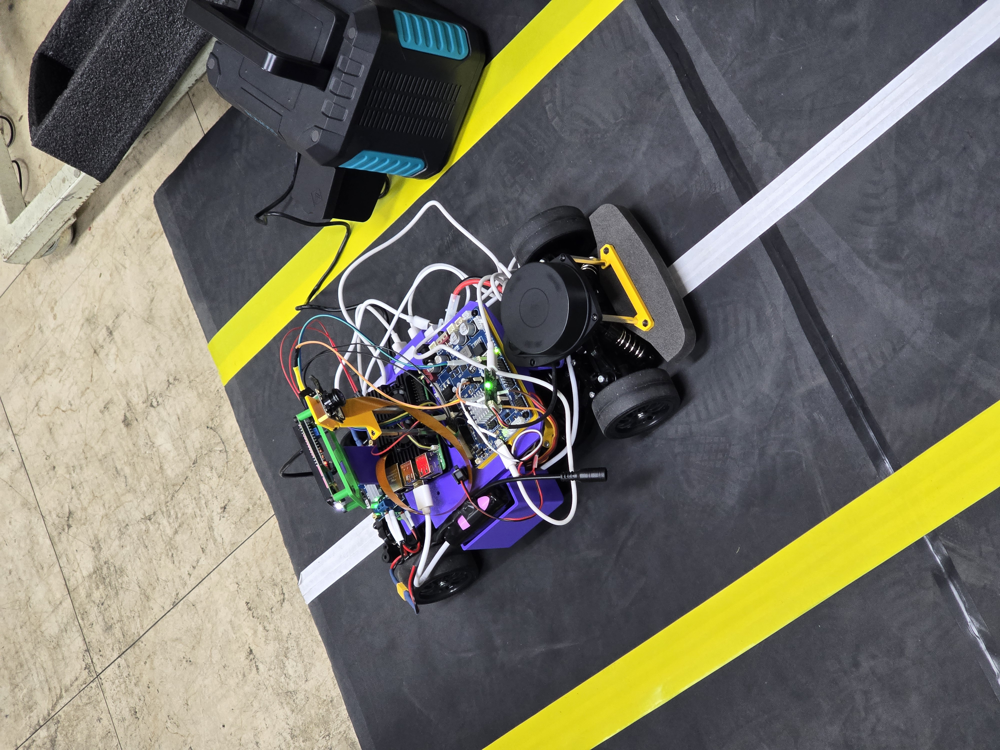

### 완성

  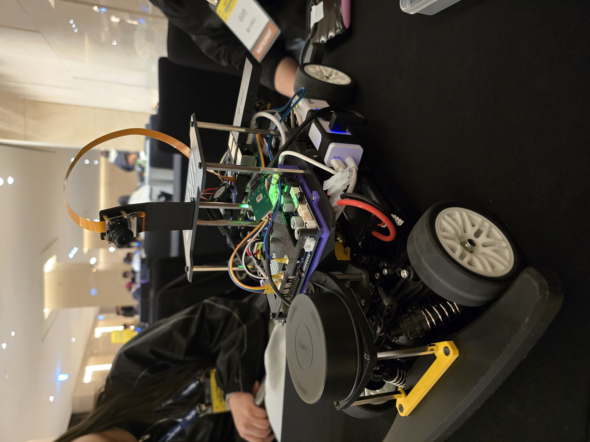
  
  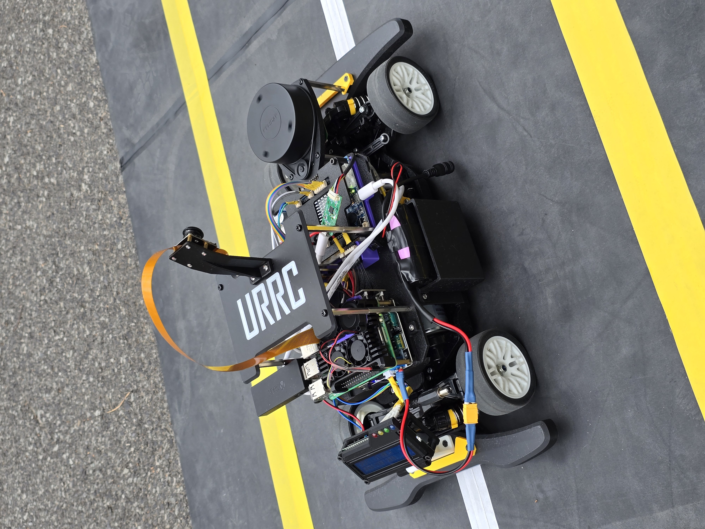

### 🎥 작동 영상
<!-- GitHub README는 <video src> 태그를 렌더링하지 않아, GIF로 변환해 바로 재생되도록 대체 -->

  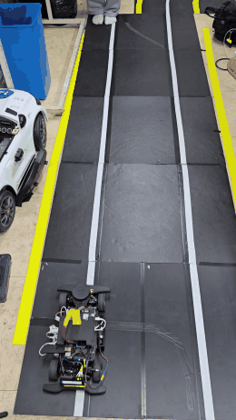
  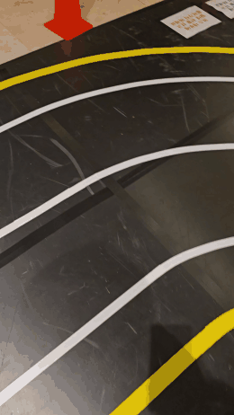

주행 및 차선 변경 영상

  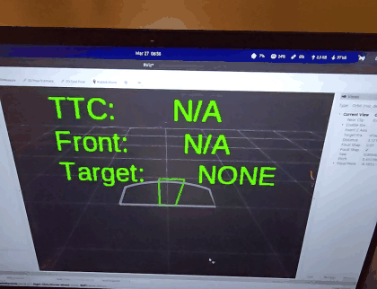

LiDAR 가변 ROI rviz 테스트 영상

---

## 📎 그 외 구현 요소 (간략)

| 구성 요소 | 내용 |
|---|---|
| 차선 인식 | BEV 변환 + HSV 세그멘테이션 + Sliding Window 기반 실시간 차선 검출 (OpenCV, C++) |
| Pure Pursuit 제어 | 차선 모델 기반 조향 계산, 차선 변경 FSM, TTC 기반 속도 제어 |
| LiDAR-카메라 퓨전 | 캘리브레이션 도구 및 좌표계 정합, 장애물 클러스터링/추적 |
| 시스템 구성 | ROS 2 다중 노드 launch 체이닝, 실시간 파라미터 튜닝 인터페이스 |

---

## 💭 느낀점

대회 규정상 허용된 기본 베이스를 제외한 모든 부분을 직접 설계·제작해야 해서 어려움이 많았지만, 그만큼 최적의 성능을 끌어내기 위해 센서 배치 하나하나에 신경 썼습니다. 특히 메인 컨트롤러인 Raspberry Pi 5의 CPU 점유율을 아끼기 위해 디버깅용 토픽 echo 창을 여러 개 띄워둘 수 없었는데, 이를 대신해 차량 후방에 LCD와 LED를 달아 차량 상태·Pure Pursuit 경로·LiDAR 감지 결과를 표시했습니다. 불필요한 토픽 구독을 줄인 만큼 실제 주행 연산에 쓸 수 있는 자원을 확보하는 데 큰 도움이 됐습니다.

MUX는 조이스틱, Pure Pursuit, OpenCR 피드백에서 들어오는 속도·조향 값의 우선순위를 판단해 조정합니다. 카메라·LiDAR·OpenCR·Raspberry Pi 5 등 각 센서/보드가 서로 다른 주기(Hz)로 토픽을 발행하기 때문에, 이 차이에서 오는 병목현상을 줄이는 데 초점을 맞춰 설계했고 실제 주행에서도 안정적으로 잘 작동했습니다.

초기 테스트에서 속도가 빨라질수록 벽이나 주변 물체를 주행 경로상의 장애물로 오인식하는 문제가 있었습니다. 이를 해결하기 위해 가변 ROI 로직을 도입했고, TTC(Time-to-Collision) 기반으로 장애물과의 상대속도·충돌 예상 시간을 함께 계산해 오인식으로 인한 오차를 줄였습니다. 실제 주행에서도 의도한 대로 잘 작동했습니다.

